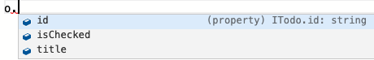
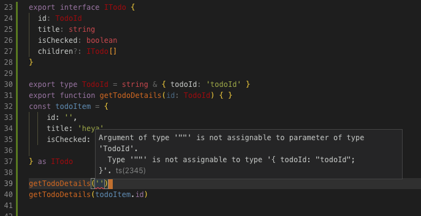

## Manageable and Extendable Objects

---

### Classes vs. Interfaces

- Classes are used when you expect the app to generate instances.<!-- .element: class="fragment" -->
- Interfaces work best when they are served from an external source.<!-- .element: class="fragment" -->

Note: Introduction that in the past (anecdotal) seen a lot of use of classes to define data models in the frontend, as people are used to doing it in the backend.

---

```
export class Todo {
    constructor(
        readonly id: number, // or string works too of course!
        readonly title: string,
        public isChecked: boolean // No access modifier; no assignment after compilation!
    ) {}
}
```

Note: Looks fine right? And this works well for the time being.

---

### The requirements change

```
export class Todo {
    constructor(
        readonly id: string, // We should've done UUIDs from the start
        readonly title: string,
        public isChecked: boolean,
        public children?: Todo[]
    ) {}

    hasChildren(): boolean {
        return this.children && this.children.length > 0
    }
}
```

Note: The requirements get a bit more complex, and suddenly do we not only have lot's of changes throughout our existing code cause we changed the constructor. We've also gotten us an optional variable that we may have to assign at some existing places or not. We don't know for sure unless we check all of them! You can imagine how this goes on in the real world on a regular basis.

----

```
@Component({
    changeDetection: ChangeDetectionStrategy.OnPush,
    template: `
        <div *ngFor="let todo of todoList">
         {{ todo.title }}
         <div *ngIf="todo.hasChildren()">
            <div *ngFor="let child of todo.children">
                {{ child.title }}
            </div>
         </div>
        </div>
    `
}
export class TodoListComponent {
    todoList: Todo[]
}
```

---

## The good parts of a class

- Perfect type completion.<!-- .element: class="fragment" -->
- Good idea to try and keep only 1 domain entity instead of multiple.<!-- .element: class="fragment" -->
- Objects are recognizable runtime<!-- .element: class="fragment" --> `console.log(todoItem) -> Todo { .. }`<!-- .element: class="fragment" -->
- Compile errors!<!-- .element: class="fragment" -->

Note: Yes, compile errors are a good thing. It's the compiler alerting you to actual faults in your code.

---

## The bad parts of a class

- Extendability is limited without breaking existing code<!-- .element: class="fragment" -->
- Transform your external data (by use of .map()) to get the benefits<!-- .element: class="fragment" -->
- Compile errors!<!-- .element: class="fragment" -->
- Long constructors are very painful. TSLint says so! (7)<!-- .element: class="fragment" -->

Note: Compile errors also will happen in for example your testdata or tests, which may not show up during regular development time. Also, too many compile errors when the refactoring is too big will cause loads of pain.

---

## So classes are terrible!

- No. They're useful, but don't abuse them.<!-- .element: class="fragment" -->
- They're perfect for limited and specifcally scoped pieces of code<!-- .element: class="fragment" -->
- Like, the creation of an object that is the minimum requirement to create a Todo.<!-- .element: class="fragment" -->
- In simple use cases, the service that POSTs could create the object.<!-- .element: class="fragment" -->

Note: Well, no they're not. They're necessary and are a good way to limit a specific scope. 

----

```
export class Todo {
    constructor(readonly title: string) {}
}
```
<!-- .element: class="fragment" -->

```
@Injectable()
export class TodoService {
    createNewTodo(todo: Todo): Observable<string> {
        return this.http.post(url, todo).pipe(
            map(newTodo => newTodo.id)
        )
    }
}
```
<!-- .element: class="fragment" -->

Note: Just a quick example of what this could look like.

----

```
@Injectable()
export class TodoService {
    createNewTodo(title: string): Observable<Todo> {
        const obj = {
            title: title
        } as Todo
        return this.http.post<Todo>(url, obj)
    }
}
```
<!-- .element: class="fragment" -->


---

## So why interfaces?

- Useful when the data is external (like from an API).<!-- .element: class="fragment" -->
- No painful compile errors when the "contract" changes.<!-- .element: class="fragment" -->
- Easier to compose complex objects with<!-- .element: class="fragment" -->

This makes the objects you use in your app more manageable and extendable. ✌️<!-- .element: class="fragment" -->

---

### Let's take the previous examples

```
// The `I` prefix is very oldschool. Angular Styleguide marks this as something to consider not doing.
export interface ITodo {
    id: string // or a number! If this changes, it doesn't hurt as much.
    title: string
    isChecked: boolean
    children?: ITodo[]
}
```
<!-- .element: class="fragment" -->

```
@Injectable()
export class TodoService {
    getTodoList(): Observable<ITodo[]> {
        return this.http.get<ITodo>(url)
    }
}
```
<!-- .element: class="fragment" -->

---

- When the details change, you change them in 1 place only.<!-- .element: class="fragment" -->
- Compile errors are limited to hardcoded data you may use in the application.<!-- .element: class="fragment" -->
- Angular Styleguide recommends Interfaces for data models.<!-- .element: class="fragment" -->
- Type completion in usage is still very good.<!-- .element: class="fragment" -->


<!-- .element: class="fragment" -->

Note: So these are the pros of doing it this way. Cons are in the form of no runtime, name clashing with  classes for creation and it's more difficult to implement domain specific logic in one spot. If TypeScript could be a bit more help here, this would be so powerful to use... (class implements interface, gives you the assignments for free.)

---

### So we've made it more manageable, but what about extendable?

- Interfaces grow easily, where classes will try hurt you all the time.<!-- .element: class="fragment" -->
- Interfaces can easily be composed by using more interfaces.<!-- .element: class="fragment" -->
- As your project grows, so does your domain model.<!-- .element: class="fragment" -->

----

```
export interface Todo {
    id: string
    title: string
    status: TodoStatus
    owner: User
    children: Todo[]
}
```

```
export type TodoStatus = 'unchecked' | 'in-progress' | 'done' | 'late'
```

```
export interface User {
    id: string
    name: string
    email: string
    lastOnline: Date
    // And so on!
}
```

---

### And we can even go more type safe!

```
export type TodoId = string & { todoId: 'todoId' }
```

```
export interface Todo {
    id: TodoId
    ...
}
```

```
@Injectable()
export class TodoService {
    getTodoDetails(id: TodoId) {}
}
```
Note: You are now casting your external data to type specific ID's. You can write functions that will only take certain ID's or whatever. You can go completely nuts with this of course! Not saying you can't do this with classes, but you'll have to cast all your assignments instead of the compiler just assuming they are.

---



Note: You see the raw empty string breaks, but the one we inferred from our created object works fine. **This is a powerful slide, make sure we go through this one completely.**

---

## Conclusion

- Classes are good when used for a very specific scope.<!-- .element: class="fragment" -->
- Interfaces rule for any external data.<!-- .element: class="fragment" -->
- Be type safe!<!-- .element: class="fragment" -->

---

# Thank you!

### Any questions?
